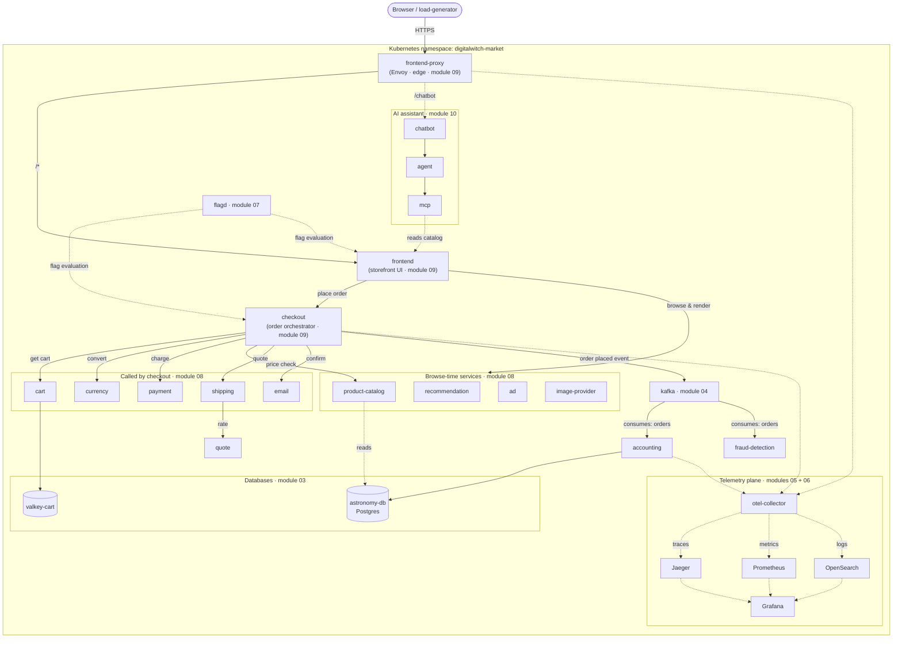

# Architecture

The same system the 10 modules deploy, drawn as one picture. Solid arrows are
the request a shopper's order actually takes; dashed arrows are telemetry
converging on the collector, and feature-flag reads from flagd.

## Reading this against the modules

- **Modules 01–02** (foundation, configuration) aren't drawn — they're the
  namespace, storage class, ConfigMaps and Secrets everything else in this
  picture depends on existing first.
- **Module 03** is the `data` group (Postgres, Valkey).
- **Module 04** is `kafka`, `accounting`, `fraud-detection`.
- **Module 05** is the `telemetry` group's four backends (Jaeger, Prometheus,
  OpenSearch, Grafana) plus the OpAMP server (not drawn — it's a control-plane
  detail, see the module 05 README).
- **Module 06** is `collector` — deployed after module 05 because it needs
  those backends running to export to.
- **Module 07** is `flagd`.
- **Module 08** is everything in `browse` and `fulfill`.
- **Module 09** is `frontend`, `checkout`, `proxy`, plus the load-generator
  (not drawn — it just plays the same role as the browser at the top).
- **Module 10** is the `ai` group — deployed last, on top of a storefront
  that already works without it.

Left off the diagram entirely: `telemetry-docs` (serves generated schema
docs, not part of any request path) and `opamp-server` (remotely
reconfigures the collector, cart, product-catalog and chatbot — real, but
mostly adds crossing lines to boxes already shown).
